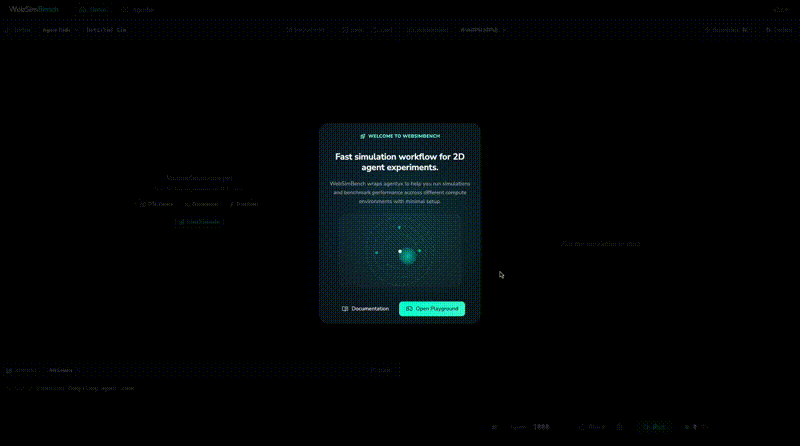
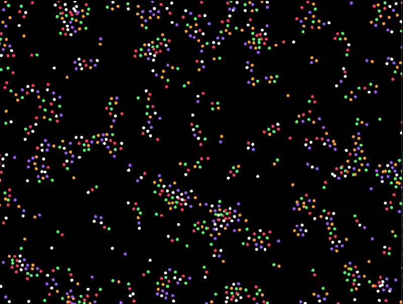
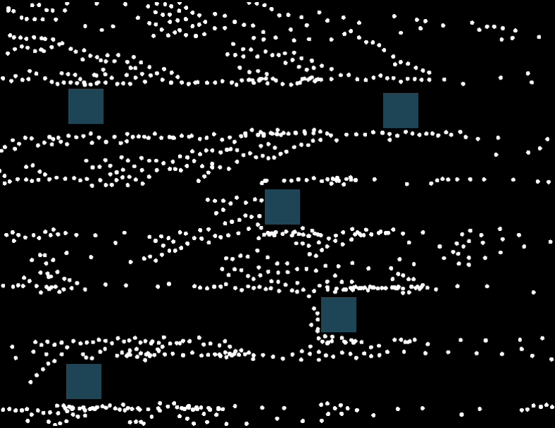
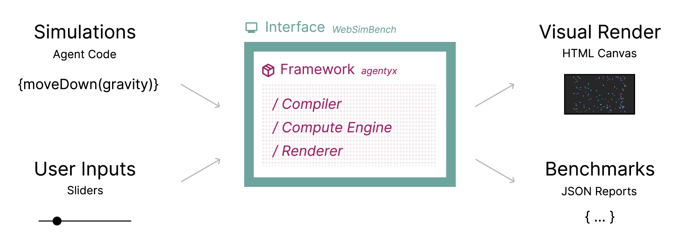
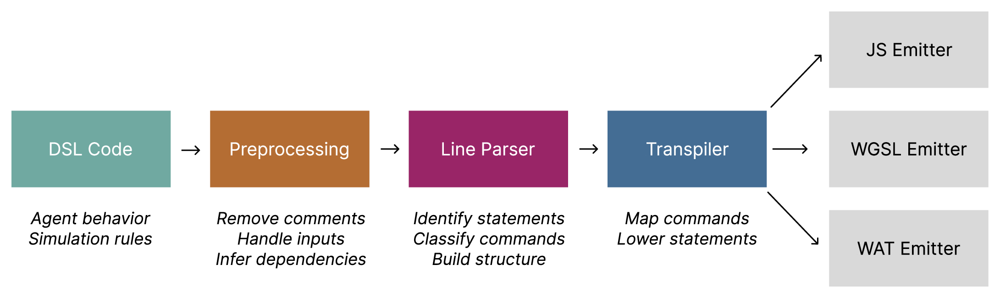
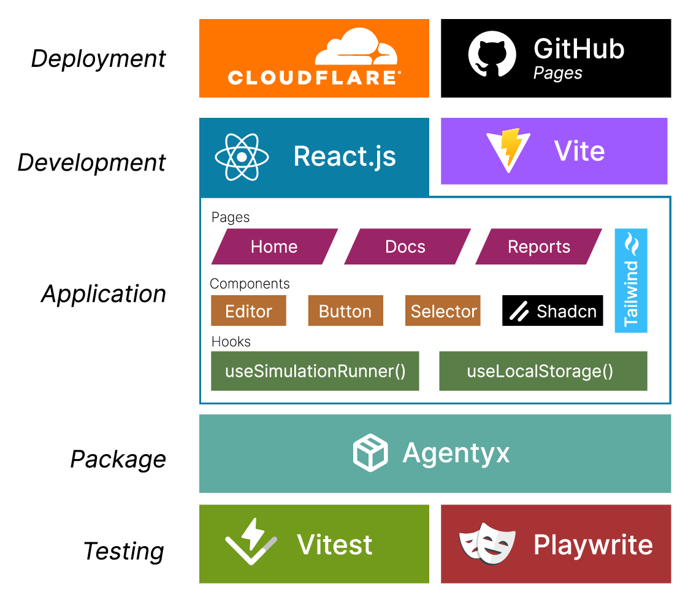
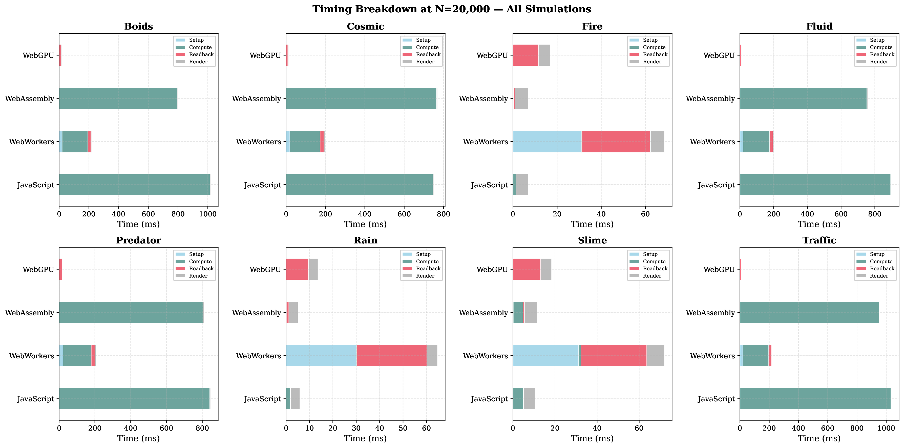
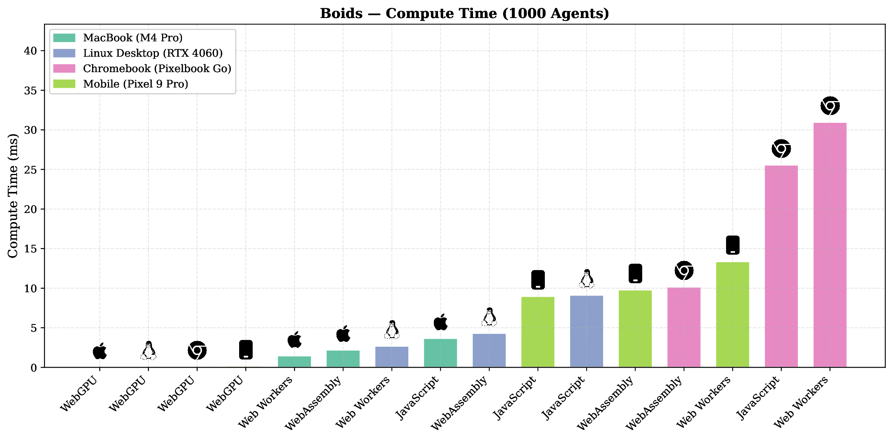
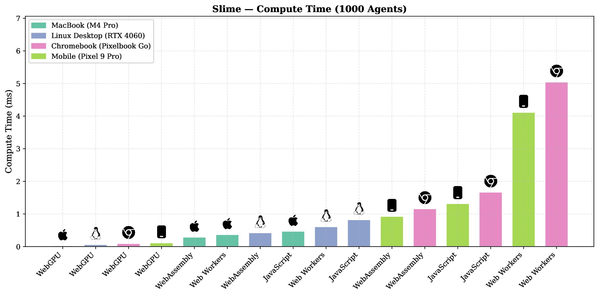
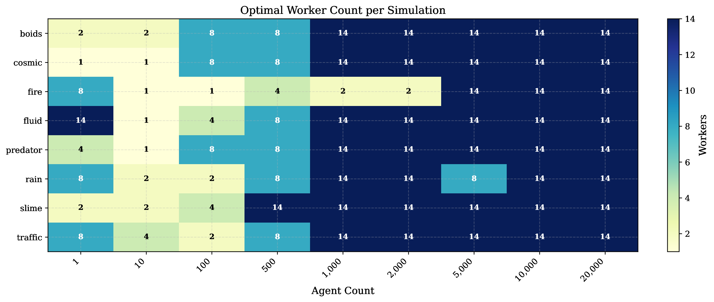

<div align="center">

<br/>



<br/>

# WebSimBench

### A high-performance agent-based simulation engine and playground for the web.

Build, run, and benchmark agent based simulations entirely in the browser across **JavaScript**, **WebWorkers**, **WebAssembly**, and **WebGPU** by writing one Agent Script.

<br/>

[](https://www.npmjs.com/package/@websimbench/agentyx)
&nbsp;
[](https://websimbench.dev)
&nbsp;
[](https://websimbench.dev/#/docs/latest/overview)

</div>

<br/>

---

<br/>

## Simulation Showcase

Real emergent behaviour produced by the Agentyx DSL, running at 60fps on commodity hardware.

<table>
<tr>
<td align="center" width="25%">

<br/><b>Slime Mold</b>
</td>
<td align="center" width="25%">

<br/><b>Fire</b>
</td>
<td align="center" width="25%">

<br/><b>Boids</b>
</td>
<td align="center" width="25%">

<br/><b>Cosmic</b>
</td>
</tr>
<tr>
<td align="center" width="25%">

<br/><b>Fluid</b>
</td>
<td align="center" width="25%">

<br/><b>Rain</b>
</td>
<td align="center" width="25%">

<br/><b>Predator-Prey</b>
</td>
<td align="center" width="25%">

<br/><b>Traffic</b>
</td>
</tr>
</table>

<br/>

---

<br/>

## Install

```bash
npm install @websimbench/agentyx
```

Agentyx ships a custom **DSL** for describing agent behavior, with a compiler that targets JS, WebWorkers, WASM, and WebGPU — see the full [package docs](./packages/agentyx/README.md).

<br/>

<!-- ## Paper

This project is the product of a full dissertation. The complete paper is included at [`Dissertation__Copy_ (3).pdf`](Dissertation__Copy_%20(3).pdf) in this repository, covering the DSL design, multi-backend compiler pipeline, benchmarking methodology, and results.

<br/> -->

---

<br/>

## Getting Started

```bash
# Clone & install
git clone https://github.com/Morgs27/websimbench.git
cd websimbench
npm install

# Run the dev server
npm run dev
# → http://localhost:5173
```

<br/>

---

<br/>

## Architecture

<div align="center">

</div>

<br/>

Agent scripts are compiled through a multi-stage pipeline that emits optimised code for each backend.

<div align="center">

</div>

<br/>

<details>
<summary><b>Full Tech Stack</b></summary>
<br/>
<div align="center">

</div>
</details>

<br/>

---

<br/>

## Benchmark Results

All benchmarks were run across four devices — MacBook M4 Pro, Linux Desktop (RTX 4060), Chromebook (Pixelbook Go), and a Pixel 9 Pro.

### Timing Breakdown — 20 000 Agents

<div align="center">

</div>

<br/>

### Cross-Device Compute Time (1 000 Agents)

<table>
<tr>
<td align="center" width="50%">

</td>
<td align="center" width="50%">

</td>
</tr>
</table>

<br/>

### Optimal Worker Count

<div align="center">

</div>

<br/>

## Contributing

Contributions are welcome! Open an issue or submit a pull request.

</div>
