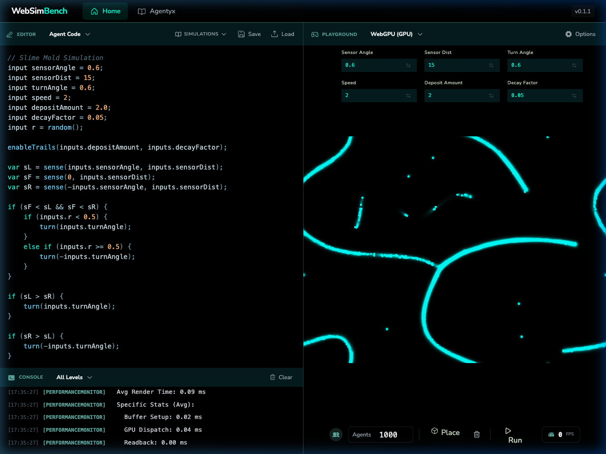

<div align="center">
  

# WebSimBench

**A high-performance web wrapper and simulation playground for the `agentyx` engine.**

[](https://www.npmjs.com/package/@websimbench/agentyx)
[](https://websimbench.dev)

</div>

---

## Live Demo & Documentation

Explore the interactive sandbox and view the full documentation at:

**[https://websimbench.dev](https://websimbench.dev)**

Experience the engine directly in your browser without any installation. The live site features interactive premade simulations, an in-browser code editor, and the complete versioned documentation.

## About the Project

WebSimBench is the official sandbox and graphical interface for the **Agentyx** engine. It provides an intuitive, high-performance web application designed for exploring, building, and benchmarking massive agent-based models right in the browser.

Through the platform, users can switch between JavaScript, WebAssembly, and full GPU-accelerated computing seamlessly.

### The Agentyx NPM Package

The core engine powering WebSimBench is available as a standalone NPM package: `@websimbench/agentyx`.

It provides a custom Domain Specific Language (DSL) tailored for describing agent behavior, compiling it down for execution across JS, WebWorker, WASM, and WebGPU backends.

```bash
npm install @websimbench/agentyx
```

Check out the [Agentyx Package Readme](./packages/agentyx/README.md) for full integration details.

---

## In-Browser Execution

Watch how WebSimBench runs thousands of agents in real-time, completely client-side:

<div align="center">
  
</div>

_A live recording demonstrating emergent behavior in the Slime Mold simulation model with WebGPU rendering._

---

## Getting Started Locally

Want to run the WebSimBench platform securely on your own machine, or contribute to its development? Here's how to spin it up:

### Prerequisites

- [Node.js](https://nodejs.org/) (v18 or newer recommended)
- `npm` (comes with Node)

### Installation & Execution

1. **Clone the repository:**

   ```bash
   git clone https://github.com/morgs27/websimbench.git
   cd websimbench
   ```

2. **Install all dependencies:**

   ```bash
   npm install
   ```

3. **Start the development server:**

   ```bash
   npm run dev
   ```

4. **Open your browser:**
   Navigate to `http://localhost:5173` to view the application in action.

---

## Contributing

We welcome community discussion and contributions! If you have ideas, open an issue or submit a pull request.
